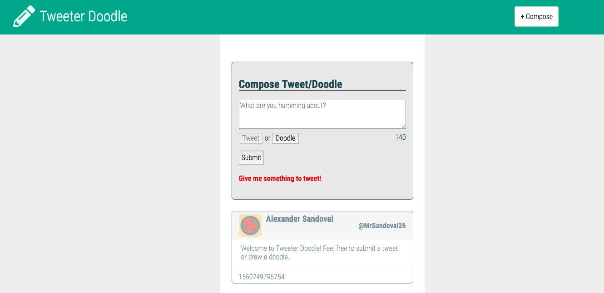
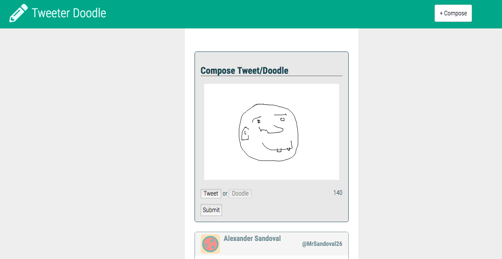
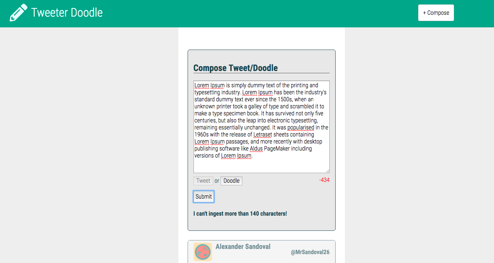

# Tweeter-Doodle Project

Tweeter-Doodle is a simple, single-page Twitter clone that incorporates an added doodle feature for users to submit.

Heroku Deployment: <https://tweeter-doodle.herokuapp.com/>

## Getting Started

1. Fork this repository, then clone your fork of this repository.
2. Install dependencies using the `npm install` command.
3. Start the web server using the `npm run local` command. The app will be served at <http://localhost:3000/>.
4. Go to <http://localhost:3000/> in your browser.

## Dependencies

- body-parser
- dotenv
- Express
- MongoDB
- Node 5.10.x or above

---
## Final Project

URLs Page:

Doodle Feature Screenshot:

140+ Character Error message: 
